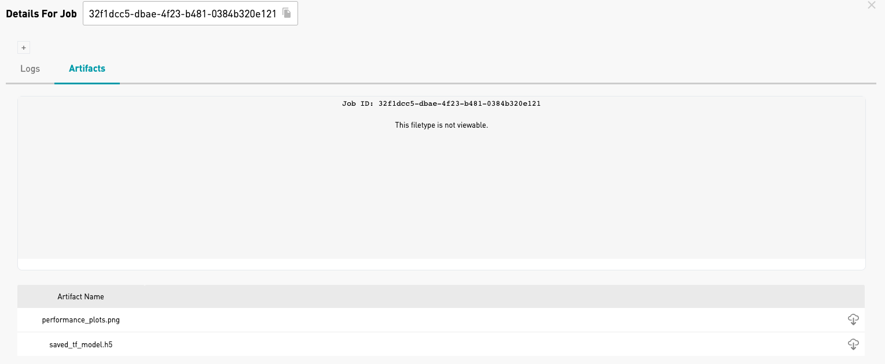

 Powered by 

 

# Fake vs. Real Trump Twitter Classifier with Tensorflow 2.0
The task is to classify a given Trump tweet as real or fake. 

## Data
A csv file is included in the `code` folder that contains the tweets and labels.
You will need to download the pretrained word-embeddings from the following website:`https://fasttext.cc/docs/en/english-vectors.html`. From this website, download `wiki-news-300d-1M.vec.zip` and unzip it inside the `data` folder. The data folder should now have `wiki-news-300d-1M.vec` inside it. 

## The model
We train a deep 1D convolutional network that predicts the probability of a tweet being real or fake. In this repository, you can easily train this model by following the steps below.

## Requirements
1) Install Atlas from https://atlas.dessa.com
2) Install Docker from https://docs.docker.com/install/ and start the docker service locally on your computer
3) Install Anaconda (if not already installed)
4) Install `python >= 3.6.9` in a new environment

## Why Atlas?

With Atlas, we're excited to bring you a machine learning platform 
which ships with a local scheduler and Python SDK which enables developers 
to manage hundreds of experiments while ensuring full reproducibility.
* Atlas allows you to quickly schedule Python code to be run on CPUs or GPUs.
* Atlas automatically creates the appropriate Python environment to run the job and discards it once the job is completed.
* Atlas allows the user to run and track many ML experiments. The Atlas GUI 
(running at https://localhost:5555) gives the user a comprehensive view 
of all the ML experiments in one place.

## Converting any code to run in Atlas
With only a few lines of code, you can convert your code to be Atlas-friendly. For reference, please see the `try/except` commands in `main.py` where we have introduced Atlas code to track ML experiments. 

Atlas spins up Docker containers to run the code. 
In order to provide the data to this Docker container, 
we need to mount the `data/` folder into the containers. 
In order to do so, open the `job.config.yaml` inside `code/` directory. Under the `volumes` section, replace the path with the absolute path of the data. 

## How To Run It
CD into the "code" directory in order to run `main.py`. You may run the job with or without foundations. Please see the following commands to run the code:

| Run Job           | Terminal command                |   Purpose              |   
|----------------|--------------------------|-----------------------------------|
|      Without Foundations     | `python main.py`           | To run code normally               |                          
| Only one job with foundations| foundations submit scheduler . main.py       | To run any python code with foundations                 |
|      Run multiple ML experiments    | python submit_jobs.py                   | To track multiple experiments and find the best ML model                |

## Baseline Model
Around line 68 in `main.py`, we have included a flag `USE_BASELINE_PARAMS = False` so that you can run experiments with random hyperparameters. But, in case you want to run the baseline model, just set this flag to be `True`.

The baseline validation accuracy is approx. 75%. But, with some ML experiments, this baseline accuracy can be further improved.

Below are some screenshots of running ML experiments with foundations.

##Run a single job with foundations

Once the job is deployed from the terminal, it can be viewed in Foundations GUI by going to internet browser - https://localhost:5555.

##Launch multiple ML experiments with foundations

##Foundations Artifacts
The artifacts lets you save any object you want to track along with the ML experiments. These artifacts are also accessible from the GUI.
In the GUI, you can see multiple experiments that have finished running along with their performance. In order to view the performance plots, click on the square box at the end of a corresponding row. You should see an artifacts window opening up where you can see the performance_plots.png and saved_model.h5.

Artifacts can also save the trained model that can be used for production or further analysis. In the artifact viewer, you can see `saved_model.h5`, you can download this trained model onto your computer.

In order to see the performance plots while training of model, click on `performance_plots.png`:

If you click on `Project Overview`, you will see a plot of model metrics for each ML experiment that was run using Foundations.

So, try running some experiments using Foundations and let us know if you have any feedback, questions or suggestions. We would like users to take advantage of Foundations and significantly improve the baseline model performance.

