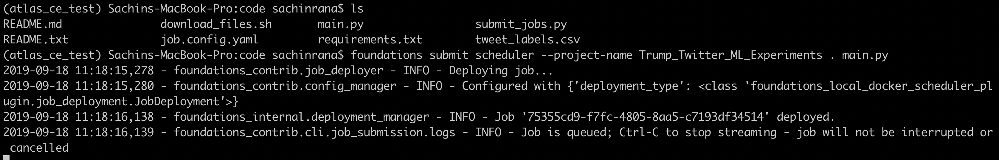
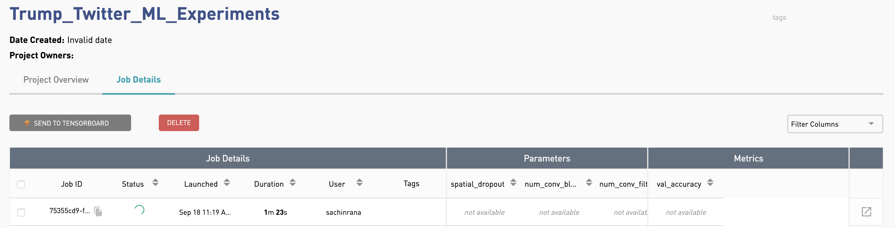
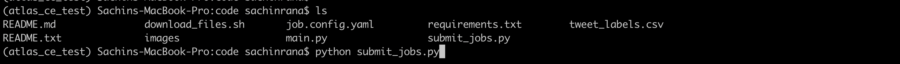
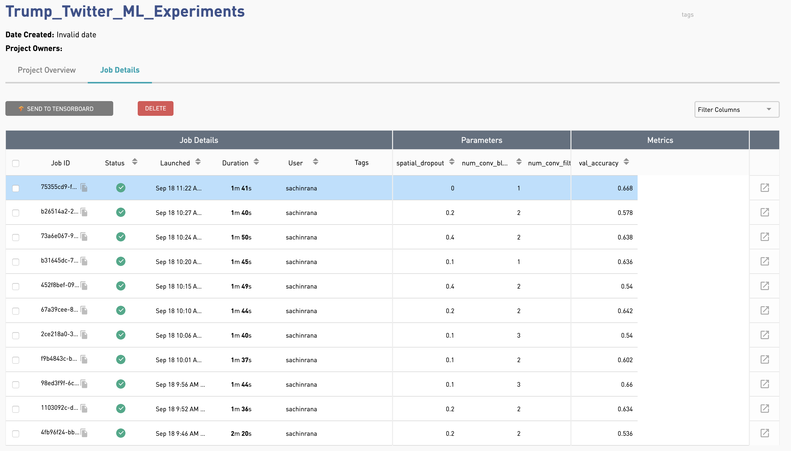
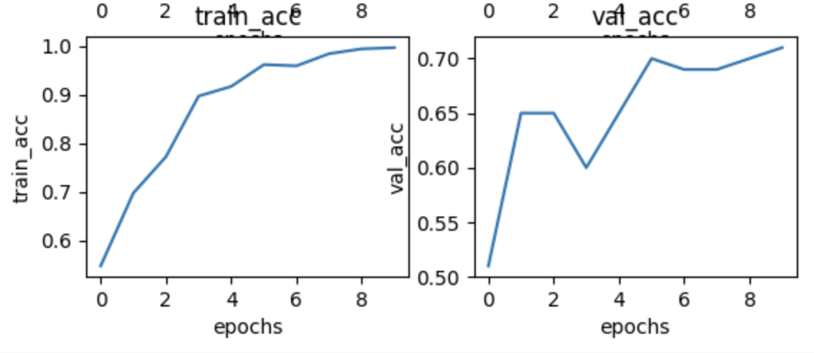
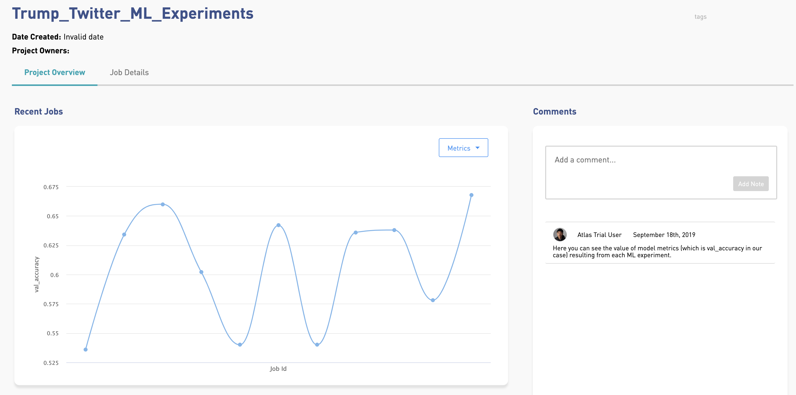

 Powered by 

 

# Fake Vs Real Trump Twitter Classifier Using Tensorflow 2.0
The task is to classify a given Trump Tweet as Real or Fake. 

# The ML Model
We used a deep 1D convolutional network that predicts the probability of a tweet being real or fake. In this repository, you can easily train this model by following the steps below and quickly build your own state of the art Trump tweet classifer.

## Data
A csv file is included in the `code` folder that contains the tweets and it's labels.
You will need to download the pretrained word-embeddings from the following website:`https://fasttext.cc/docs/en/english-vectors.html`. From this website, download `wiki-news-300d-1M.vec.zip` and unzip it inside the `data' folder. So, the data folder should now have "wiki-news-300d-1M.vec" inside it. 

## Requirements
With Foundations:
1) Install docker from https://docs.docker.com/install/ and start the docker service locally on your computer
2) Install Anaconda (if not already installed)
3) Install python>=3.6.9 in a new environment
4) Install Foundations  from https://atlas.dessa.com

Without Foundations:
1) Install Anaconda (if not already installed)
2) Install python>=3.6.9 in a new environment
3) Pip install -r requirements.txt

# Why run with Foundations?
1) Foundations allow you to quickly schedule python jobs to be run on CPUs or GPUs.
2) It automatically creates the appropriate python envoironment to run the job and discards it once the job is completed.
3) It allows user to run and track multiple ML experiments. The GUI (running at https://localhost:5555) gives the user a comprehesive view of all the ML experiements at one place.

# How to convert any code to run in Founations Atlas?
With only a few lines of code, you can convert your code into Foundations Atlas. For the reference, please see the `try/ except` commands in `main.py` where we have introduced a few lines of foundations code in order to track ML experiments. 

Foundations spin up docker containers inside which the code actually runs. In order to provide the data to this docker container, we need to mount the data/ folder into the docker containers. In order to do so, open the `job.config.yaml` inside code/ directory. Under the `volumes` section, replace the path with your absolute path of the data. 

## How To Run It
CD into the "code" direcotry in order to run `main.py`. You may run the job with or without foundations. Please see the following commands to run the code:

| Run Job           | Terminal command                |   Purpose              |   
|----------------|--------------------------|-----------------------------------|
|      Without Foundations     | `python main.py`           | To run code normally               |                          
| Only one job with foundations| foundations submit scheduler . main.py       | To test if your foundations is working properly                 |
|      Run multiple ML experiments    | python submit_jobs.py                   | To run and track multiple ML experiments                 |

## Baseline Model
Around line 68 in `main.py`, we have included a flag `USE_BASELINE_PARAMS = False` so that you can run experiments with random hyperparameters. But, in case you want to run the baseline model, just set this flag to be `True`.

The baseline validation accuracy is approx. 75%. But, with some ML experiments, this baseline accuracy can be further improved.

Below are some screenshots of running ML experiments with foundations.

##Run a single job with foundations

Once the job is deployed from the terminal, it can be viewed in Foundations GUI by going to internet browser - https://localhost:5555.

##Launch multiple ML experiments with foundations

##Foundations Artifacts
The artifacts lets you save any object you want to track along with the ML experiments. These artifacts are also accessible from the GUI.
In the GUI, you can see multiple experiments that have finished running along with their performance. In order to view the performance plots, click on the square box at the end of a corresponding row. You should see an artifacts window opening up where you can see the performance_plots.png and saved_model.h5.

Artifacts can also save the trained model that can be used for production or further analysis. In the artifact viewer, you can see `saved_model.h5`, you can download this trained model onto your computer.

In order to see the performance plots while training of model, click on `performance_plots.png`:

If you click on `Project Overview`, you will see a plot of model metrics for each ML experiment that was run using Foundations.

So, try running some experiments using Foundations and let us know if you have any feedback, questions or suggestions. We would like users to take advantage of Foundations and significantly improve the baseline model performance.

